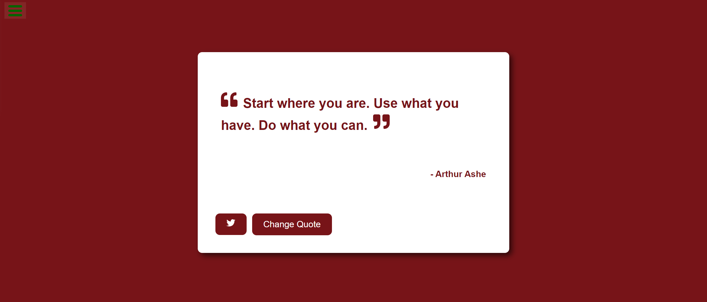

# Random Quote Machine 🔁

## Description 📜

The Random Quote Machine is a simple web application that displays random quotes along with their authors. Users can fetch new quotes and share them on Twitter. This project is built using React  to fulfill the requirements of the freeCodeCamp Front End Development Libraries projects.

## Features 🎉

- Display a random quote and author on page load
- Fetch a new quote on button click
- Share the current quote on Twitter
- Responsive design 

## User Stories 👧

1. I can see a wrapper element with a corresponding `id="quote-box"`.
2. Within `#quote-box`, I can see an element with a corresponding `id="text"`.
3. Within `#quote-box`, I can see an element with a corresponding `id="author"`.
4. Within `#quote-box`, I can see a clickable element with a corresponding `id="new-quote"`.
5. Within `#quote-box`, I can see a clickable `a` element with a corresponding `id="tweet-quote"`.
6. On first load, my quote machine displays a random quote in the element with `id="text"`.
7. On first load, my quote machine displays the random quote's author in the element with `id="author"`.
8. When the `#new-quote` button is clicked, my quote machine should fetch a new quote and display it in the `#text` element.
9. My quote machine should fetch the new quote's author when the `#new-quote` button is clicked and display it in the `#author` element.
10. I can tweet the current quote by clicking on the `#tweet-quote` `a` element. This `a` element should include the `"twitter.com/intent/tweet"` path in its `href` attribute to tweet the current quote.
11. The `#quote-box` wrapper element should be horizontally centered. Please run tests with the browser's zoom level at 100% and the page maximized.

### API link 
https://gist.githubusercontent.com/camperbot/5a022b72e96c4c9585c32bf6a75f62d9/raw/e3c6895ce42069f0ee7e991229064f167fe8ccdc/quotes.json

## Demo 📸




## Technologies Used 💡

- React
- CSS

## Installation 🔧

1. Clone the repository:
```bash
   git clone git@github.com:FarwaMuhibZada/random-quote-machine.git
   cd random-quote-machine
```
2. Install dependencies:
```bash
npm install
```

3. Start the development server:
```bash 
npm start
```

# Usage 🔊
Open your browser to http://localhost:3000 to view the app. You can click the "New Quote" button to fetch a new random quote. Click the "Tweet Quote" button to share the current quote on Twitter.

# Acknowledgments
- freeCodeCamp for the project idea
- Quotable API for providing random quotes

## FarwaMuhibzada 👩‍💻

- LinkedIn: [(https://www.linkedin.com/in/farwamohibzada/)]
- Email:  [(farwafarid2017@gmail.com)]


# Contributing 🙏
Contributions are welcome! Please fork this repository and submit a pull request for any improvements or bug fixes.
